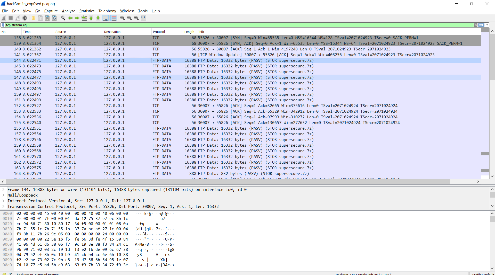
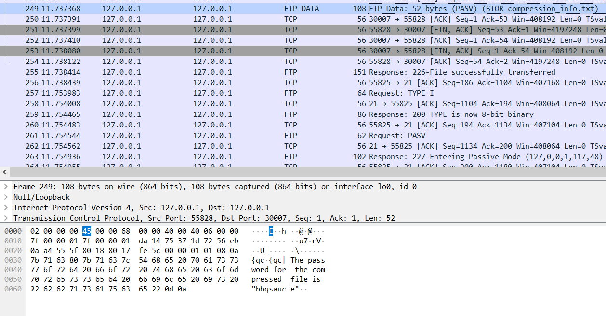
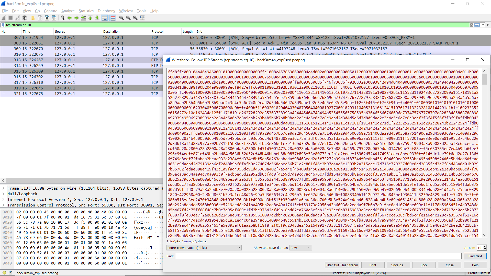

# Challenge 1 (25)
## H4ck3r_m4n exp0sed! (1)
I got this packet capture with some of the notorious h4ckerm4n's secret information.
The flag for this challenge should give you purpose.

# Solution
Analyse the pcap file and there would be a FTP data stream that contains a zip file. (supersecure.zip)
Follow the FTP Stream and it would show the entire file chunk transmitted.
Change it to RAW output and download the zip folder.


The zip folder is password protected so let's go deeper into the pcap file.
After a few more lines down, another file (*compression_info.txt*) is transmitted over. Inside it contains the password for the zip file.
There is no need to download this file as the contents of the file can be found inside the pcap file also.

```
password = bbqsauce
```

Next, unzip the zip folder with the password obtained and there would be two files. (*dataz* & *pickle_nick.png*)
The first flag can be found by viewing the *pickle_nick.png* image.

# Flag 1
```
flag{pickl3_NIIICK}
```

---

# Challenge 2 (25)
## H4ck3r_m4n exp0sed! (2)
Go further down the pcap file and there is another image transmitted called *butter.jpg*.
Same as the previous method, follow the FTP Data Stream and download the image.

Simply open the image file and the flag can be found.

# Flag 2
```
flag{u_p4ss_butt3r}
```
