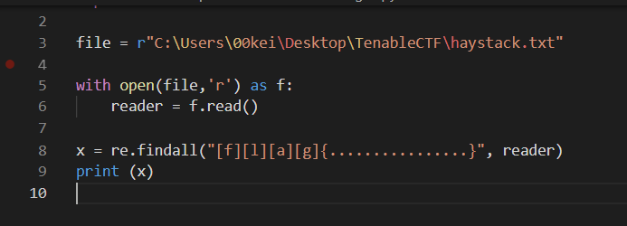

# Reggie McRegex (25)
> Find the flag in the attached file containing a haystack. Not including the quotes, the flag will be in the format of "flag{here_is_a_flag}". The text between the curly braces can consist of lowercase characters and underscores and be a maximum length of 16. You'll know it when you see it.

# Solution
First, we opened the file provided and found that it is impossible to use manual inspection or simple string filtering, so we moved on to write a regex function.
The hints provided gave away very important clues to help us write the regex function.
1. It starts with "flag{"
2. ends with "}"
3. and is 16 characters in length

So we used Python to create a simple regex function using the re library. This is not the best regex but luckily the flag showed up as the first few results lol.
```
import re

file = r"C:\Users\00kei\Desktop\TenableCTF\haystack.txt"

with open(file,'r') as f:
    reader = f.read()
    
x = re.findall("[f][l][a][g]{................}", reader)
print (x)
```


A simpler method can be done as shown below:
```
grep -o -E 'flag{[[:alpha:]|_]{16}}' haystack.txt
```
# Flag


```
flag{thy_flag_is_this}
```
