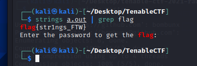

# Challenge
Do you know how to use the most powerful reversing tool on the planet? (25)

# Solution
The flag can be found simply by using the strings function.

```
strings a.out | grep flag
```

# Flag
Tada! Easy flag.


```
flag{str1ngs_FTW}
```
