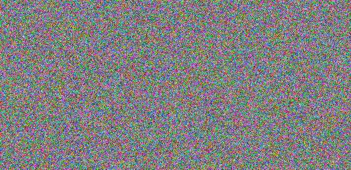
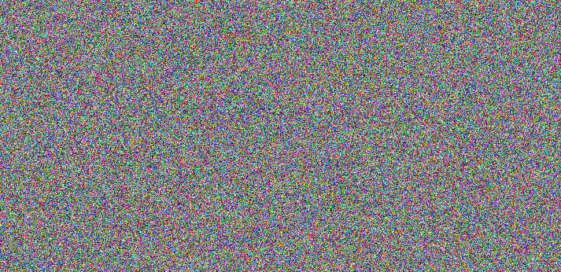
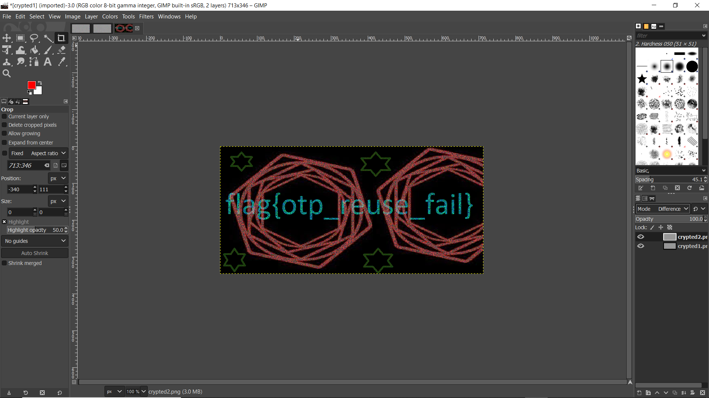

# Challenge (125)
We discovered Arasaka operatives sending wierd pictures to each other. It looks like they may contain secret data. Can you find it?

# Solution
We were provided 2 different images, each making no sense on their own.




Since, there were 2 images provided, and are somehow related to each other, we should be able to combine the image to obtain the flag.
We opened up [GIMP](https://www.gimp.org/) and loaded the first image.
Then, we add the second image on top of the first image (2nd layer)
Change the layer mode to **Difference** and the flag can be found.



# Flag
```
flag{otp_reuse_fail}
```
