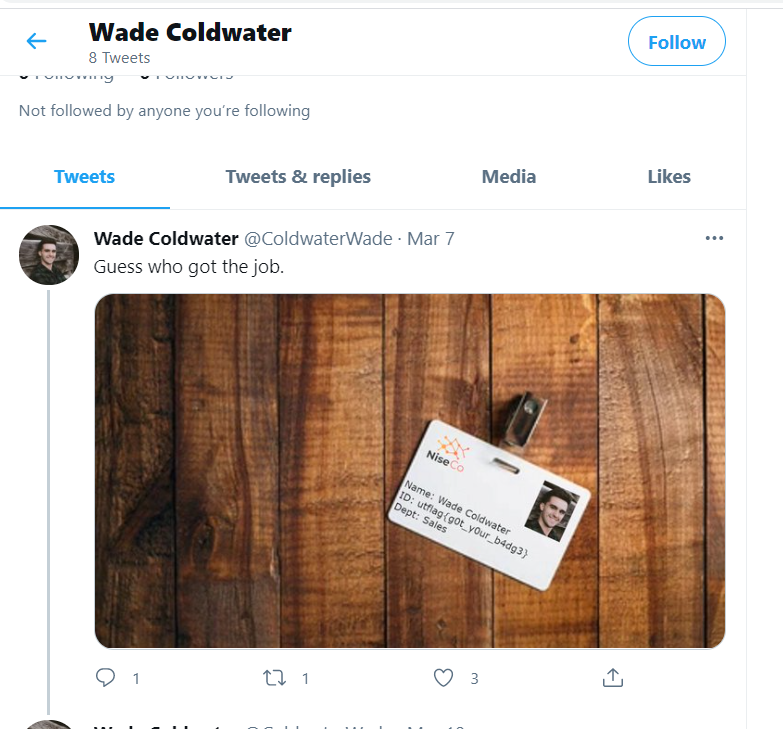

# OSINT Part 1 (735)

> Can you find any OpSec vulnerabilities?

>> 'http://misc.utctf.live:8756/'

# Solution

We visited the webpage and look for potential information that can be looked up. Some familiarity with OSINT challenges helped us to look out for certain things such as company names, employee names, email addresses, etc.

There was an employee list and the first thing that came to mind was that surely out of so many employees, one is bound to disclose the flag or give hints about the flags. Conditioned by past OSINT challenges, we went straight to Twitter and typed in every single employee name on the webpage.

We were able to find "Wade Coldwater"'s Twitter account and scrolling through his tweets, there was a tweet showing his employee pass with the flag written on it.

Flag: `utflag{g0t_y0ur_b4dg3}`
