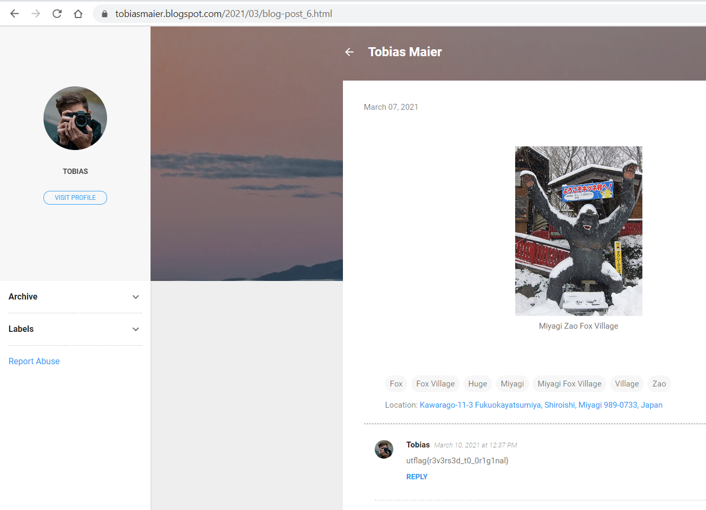

# OSINT Part 2 (766)

> Find the origins of the linked file found in part 1.

# Solution

Continuing from Part 1, there was a tweet that is linked to an image on Google Drive. We downloaded the image and then performed a reverse Google Image search which brought us to this specific blog page: 

> https://tobiasmaier.blogspot.com/2021/03/blog-post_6.html

The flag can be found in the comments under the image post.

Flag: `utflag{r3v3rs3d_t0_0r1g1nal}`
