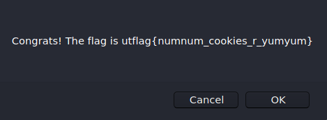

# Cutest Cookie Clicker Rip-Off (100)

> I built this awesome game based off of cookie clicker! Bet you'll never beat my high score. Hehehe!
>
> [http://web1.utctf.live:4270](http://web1.utctf.live:4270)

# Solution

Going into the challenge page will show us a Cookie Clicker game, where the goal is to beat the high score to obtain the flag. However, this seems impossible due to the ridiculously high score of 1,000,000 and we only had 30 seconds to beat it. 

We inspected the page's elements and check that is powering the game. It turns out that the game is from a JavaScript script called **game.js**. Looking further into the script, we can see that the game will reload itself after each game. With this knowledge, we can use Burp Suite to intercept the request to see some of the parameters parsed. 

From the intercepted request, we can see that the one of the parameters parsed is the user's score. 

As the goal of the game was to beat the high score of 1,000,000, we changed the user's score to something higher than the current high score before forwarding the intercepted request. 

The edited request gave us the flag.

Flag: `utflag{numnum_cookies_r_yumyum}`
