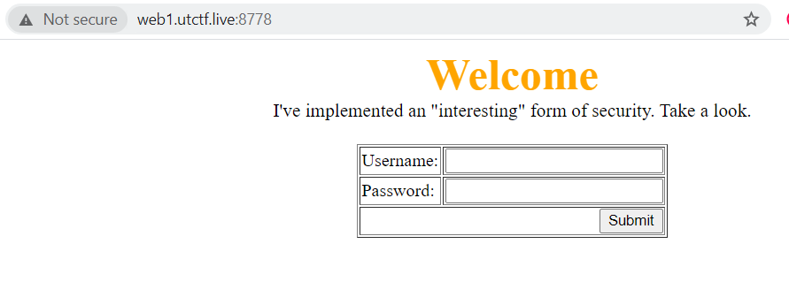
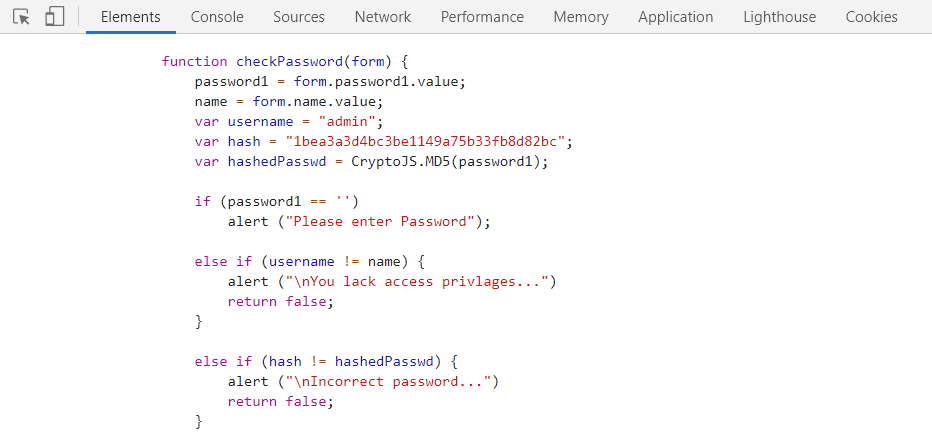
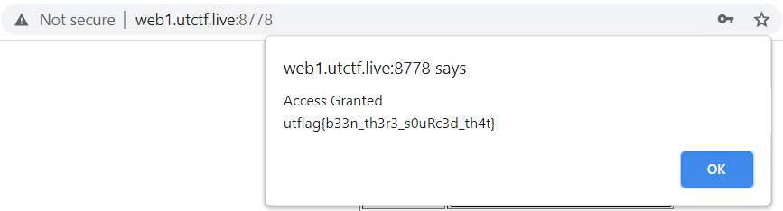

# Source it! (100)

> I found this cool more private alternative to twitter.
>> [http://web2.utctf.live:5320/](http://web2.utctf.live:5320/)


# Solution

Going into the challenge page will show us a login page.



Login pages usually have validations done to verify if the user is valid or have the correct privileges. So, to see how the input is verified, we can Inspect Element and look at the source HTML. 



In the HTML source page, we can find a JavaScript function that validates the user. It contains the username and the MD5 hash of the user's password.


MD5 hashes can be easily cracked and we were able to obtain the plaintext password by decrypting using an online tool.

```
Username: admin
Password: sherlock
```


Logging in with the above credentials will provide us the flag.



Flag: `utflag{b33n_th3r3_s0uRc3d_th4t}`
