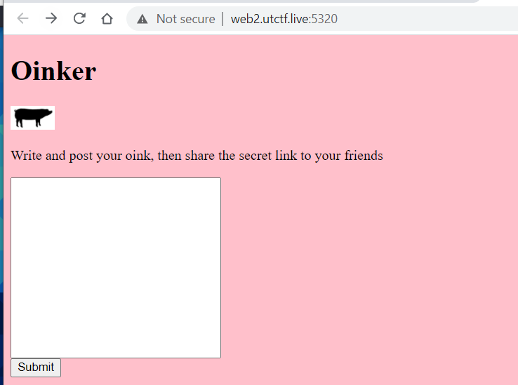
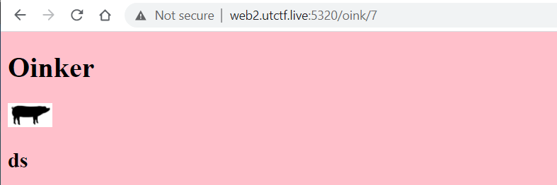
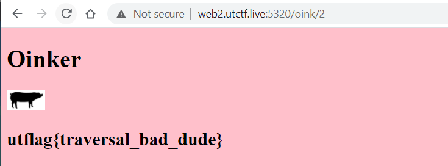

# Oinker (100)

> I found this cool more private alternative to twitter.
>> [http://web2.utctf.live:5320/](http://web2.utctf.live:5320/)

# Solution

Going into the challenge page will show a textbox where we can submit input to.

We just entered a random value into the textbox and submitted it to the server to see where it bring us to.

Looking at the URL gave us some clue that the page works by adding more pages sequentially when users create new posts. By tweaking the page number around, we were able to obtain the flag on page 2.

[http://web2.utctf.live:5320/oink/2](http://web2.utctf.live:5320/oink/2)

Flag: `utflag{traversal_bad_dude}`
